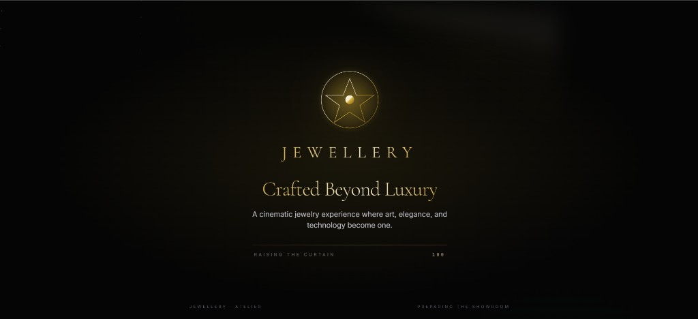
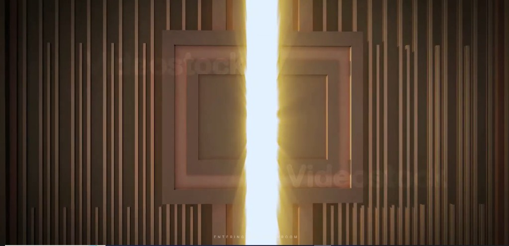
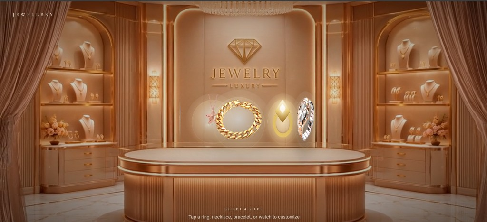
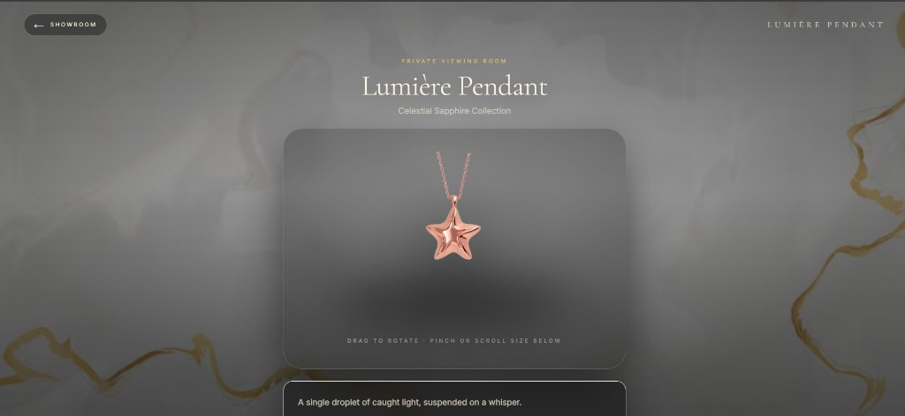

# MAJ Boutique — Prototype Development Documentation

**Project:** MAJ Boutique — Luxury Jewellery Showroom  
**Document type:** Prototype development summary  
**Repository:** [github.com/ztajwer/Prototype-MAJ](https://github.com/ztajwer/Prototype-MAJ)

---

## 1. Overview

This document outlines the development progression of the MAJ Boutique digital showroom prototype across three major iterations. The objective throughout all versions was to deliver a premium, cinema-inspired jewellery experience that reflects the standards of a luxury maison.

The prototype simulates entering a high-end jewellery environment through structured visuals, controlled motion, and product-focused interaction.

---

## 2. Prototype Development Journey

### Version 1 — Initial Concept Prototype

The first version established the foundational structure and visual direction of the MAJ experience.

#### Main objectives

- Define the initial showroom concept
- Test luxury-oriented interface layouts
- Structure jewellery presentation sections
- Evaluate colour palettes and lighting direction

#### Features implemented

- Basic landing page structure
- Luxury-themed interface framework
- Jewellery showcase sections
- Hero banners and promotional layouts
- Static visual presentation
- Early animation experiments

#### Design direction

- Dark luxury aesthetics
- Gold and rose-gold accents
- Elegant typography
- Minimal layout with premium spacing

#### Challenges

- Balancing visual realism with performance
- Creating depth without heavy 3D rendering
- Maintaining responsive behaviour
- Optimizing visual hierarchy

#### Outcome

Version 1 established the visual identity and overall creative direction of the prototype. It provided the foundation for subsequent interactive and immersive development.

#### Version 1 — Visual references

| Screen | Description |
|--------|-------------|
| Preloader | Brand introduction and loading state |
| Door entry | Transition into the showroom environment |
| Showroom | Primary product presentation layout |
| Product view | Individual piece viewing interface |

---

### Version 2 — Interactive Showroom Evolution

The second version focused on immersion, motion, spatial depth, and interaction quality.

#### Main objectives

- Introduce cinematic movement
- Build a more realistic showroom environment
- Improve transitions and scrolling behaviour
- Add depth and spatial presentation

#### Features implemented

- Enhanced scroll-based animations
- Zoom-in and zoom-out cinematic effects
- Interactive showroom sections
- Improved lighting and surface reflections
- Layered background environments
- Smooth section transitions

#### UI/UX improvements

- Cleaner layout structure
- Improved spacing and typography balance
- Stronger visual consistency
- Enhanced mobile responsiveness
- Refined luxury branding direction

#### Technical improvements

- Improved frontend structure
- Organized asset pipeline
- Animation performance optimization
- Responsive scaling across devices

#### Outcome

Version 2 significantly improved the immersive quality of the experience and moved the prototype closer to a functional luxury showroom presentation.

#### Version 2 — Demonstration

Screen recording of the interactive showroom (scroll motion, zoom, and transitions):

**File:** [`docs/assets/v2/version-2-demo.mp4`](./assets/v2/version-2-demo.mp4)

> Open the file locally or download from the repository `docs/assets/v2/` folder.

---

### Final Prototype Version

The final version combines the strongest elements from previous iterations into a polished, production-ready prototype.

#### Final vision

The final prototype simulates entering a luxury jewellery showroom through:

- Cinematic presentation
- Premium visual atmosphere
- Smooth interactions
- Realistic spatial depth
- Product-focused layout

#### Final prototype features

**Luxury showroom environment**

- Showroom-inspired interface
- Architectural composition
- Controlled lighting and depth
- Reflective and material-aware styling

**Smooth scrolling experience**

- Fluid page motion
- Controlled animation timing
- Layered depth interactions
- Scroll and touch-based zoom

**User flow**

1. Preloader — brand entry (`pla.avif` backdrop)
2. Welcome video — cinematic introduction
3. Showroom — six-product carousel with auto walk-in and scroll zoom
4. Customize room — product rotation, sizing, and configuration view

**Responsive design**

- Desktop optimization
- Tablet support
- Mobile layout with dedicated assets (`mob.png`)

---

## 3. Technical Stack

The final prototype is built with modern frontend technologies:

| Category | Technology |
|----------|------------|
| Framework | Next.js 14 (App Router) |
| Language | TypeScript |
| UI library | React 18 |
| Styling | Tailwind CSS, custom CSS |
| Animation | Framer Motion |
| 3D (available) | Three.js |
| Fonts | Playfair Display, EB Garamond, Didact Gothic |
| Tooling | ESLint, PostCSS, Autoprefixer |
| Hosting (recommended) | Vercel |

---

## 4. Project Deliverables

| Deliverable | Location |
|-------------|----------|
| Source code | GitHub repository |
| Prototype journey (this document) | `docs/PROTOTYPE-JOURNEY.md` |
| Version 1 screenshots | `docs/assets/v1/` |
| Version 2 demo video | `docs/assets/v2/version-2-demo.mp4` |
| Setup & deployment | `docs/DEPLOYMENT.md` |
| Development reference | `docs/DEVELOPMENT.md` |

---

## 5. Summary

| Version | Focus | Result |
|---------|-------|--------|
| **V1** | Visual identity and layout foundation | Established brand direction and showroom structure |
| **V2** | Motion, depth, and interaction | Improved immersion and user engagement |
| **Final** | Integration and polish | Complete cinematic showroom prototype ready for deployment |

The MAJ Boutique prototype delivers a structured luxury digital experience suitable for client presentation, further development, and production deployment.

---

*Document prepared for MAJ Boutique prototype review.*
